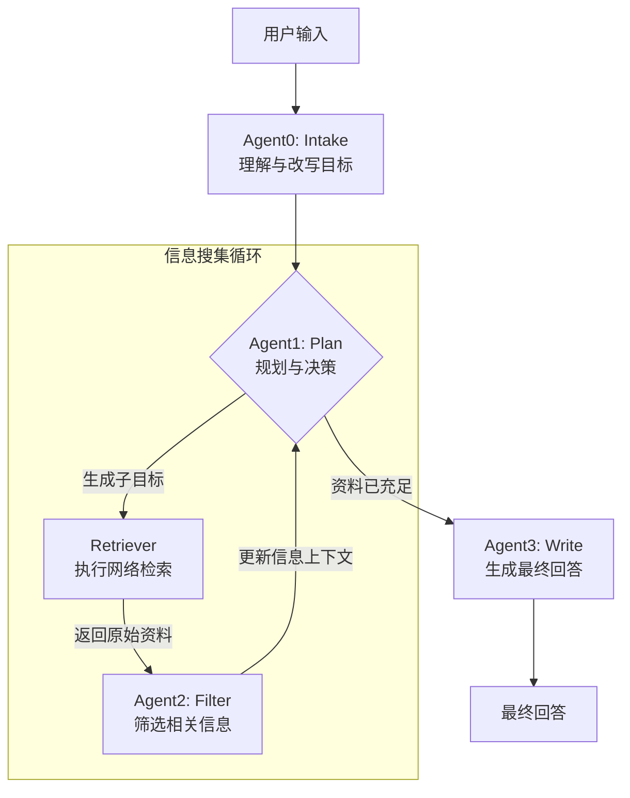

# SearchAgent

一个基于 **LangChain** + **SiliconFlow API** 的 Agent-RAG 应用。  
目标：支持多轮澄清 → 子目标分解 → 并行检索 → 重排过滤 → 最终生成回答。  

## workspace

一个结构化的、动态更新的数字工作区，用于协调多个智能代理（Agent）的工作。 它以JSON格式实现，并包含两个核心组成部分：

*   **目标 (Objective):** 存储由大语言模型（LLM）分析并清晰化后的最终任务目标。
*   **资料 (Information):** 存储智能代理为完成该目标而收集并筛选出的所有相关信息。

本质上，Workspace是一个中心枢纽或共享的“草稿纸”。它为整个系统提供了一个统一的信息视图，使得不同的智能代理能够围绕一个共同的目标，持续地进行评估、添加新资料，并最终生成详细的答案。

python -m scripts.quickstart


---

## 📂 项目结构

```
searchagent/
├─ pyproject.toml           # Poetry 配置（可选）
├─ requirements.txt         # 依赖清单
├─ .env.example             # 环境变量模板
├─ app/
│  ├─ config.py             # 读取 env / 初始化 API key
│  ├─ workspace.py          # Workspace 对象的 JSON 管理
│  ├─ schema.py             # Pydantic 数据模型
│  ├─ retrievers/           # 各类检索器
│  ├─ embeddings/           # SiliconFlow Embedding 封装
│  ├─ llm/                  # SiliconFlow Chat 封装
│  ├─ agents/               # Agent0~3 的逻辑
│  ├─ pipelines/            # 主循环流程
│  ├─ tools/                # 网页清洗、分块工具
│  ├─ storage/              # 向量库与本地存储
│  └─ server/               # FastAPI 服务端
└─ scripts/                 # 启动脚本、demo
```

---

## 🔑 环境变量

复制 `.env.example` → `.env` 并填入：

```
SILICONFLOW_API_KEY=your_api_key
SILICONFLOW_BASE_URL=https://api.siliconflow.cn/v1
TAVILY_API_KEY=xxx   # 或 SERPER_API_KEY / JINA_API_KEY
```

---

## 🚧 开发任务梳理

### 阶段 1: 基础设施
- [ ] 完成 `requirements.txt`，确保 LangChain + SiliconFlow SDK + 搜索 API 可运行  
- [ ] 在 `app/config.py` 加载 env，封装 SiliconFlow LLM/Embedding 客户端  
- [ ] 实现 `workspace.py`，支持 JSON 读写、追加资料  

### 阶段 2: 核心功能
- [ ] **Agent0**: 根据用户 query 自动生成澄清问题  
- [ ] **Agent1**: 判断 workspace 是否需要更多资料 → 输出子目标列表  
- [ ] **检索器**: 接入 Tavily / Serper / Jina → 拿到候选文档  
- [ ] **重排**: SiliconFlow `bge-reranker` 对候选文档排序  
- [ ] **Agent2**: 筛选保留文档，更新 workspace  
- [ ] **Agent3**: 汇总资料并回答主问题  

### 阶段 3: 扩展与工程化
- [ ] 支持本地向量库（Faiss/Qdrant）  
- [ ] API 服务 (`app/server/api.py`)：提供 `/query` `/workspace/{id}` `/feedback`  
- [ ] 日志与调试：在 pipeline 中记录每次 agent 决策与检索结果  
- [ ] Demo notebook：展示从 query → workspace → 回答的全流程  

---

## 📌 接下来要做的事

1. 写好 `requirements.txt` 并安装依赖  
2. 在 `app/config.py` 中封装 SiliconFlow Chat/Embedding 调用  
3. 起一个最小 demo：  
   - 输入 query  
   - Agent0 追问用户 → 改写目标  
   - 调用检索器返回候选文档  
   - Agent2 先简单保留全部文档  
   - Agent3 用文档写回答  
4. 迭代增强：加上子目标分解、并行检索和重排  
5. 最后加上 FastAPI 封装，提供 HTTP 服务  

---

## 📝 备注

- 搜索 API 可先用 Tavily，后期可换 Serper/Jina  
- Workspace JSON 保持简洁，先用 `goal` + `docs`，后续再扩展  
- 建议开发过程中用 notebook 做快速验证，再写入 `pipelines/`  

```